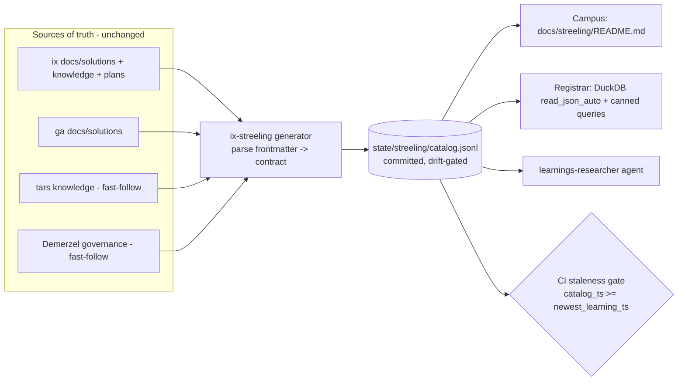

# 📚 Streeling University v1 — federated learnings hub (Campus + Registrar)

## Overview
Expose **all** institutional learnings across the ecosystem (ix + ga + tars + Demerzel) through
an index/registrar layer over the existing files — never a new source of truth. v1 ships two tiers:
**Campus** (a generated `docs/streeling/` index) and **Registrar** (a DuckDB-queryable catalog over
the learnings' frontmatter). It is the "expose" half of the Cherny `/learnings` loop and the
knowledge backbone of `docs/LEARNING.md` (PR #98). (see brainstorm: docs/brainstorms/2026-06-14-streeling-university-brainstorm.md)

## Problem Statement
~160 learning artifacts exist but are scattered and undiscoverable: ix `docs/solutions` (17) + knowledge (6) + plans (28) + brainstorms (19) + memory (91); ga `docs/solutions` (29); tars knowledge (~90); Demerzel governance. There's no front door, no cross-repo view, and the `learnings-researcher` agent must glob raw files. Knowledge that isn't found is knowledge re-learned (and re-paid-for).

## Proposed Solution
A plain-Rust generator parses each repo's learnings frontmatter into a normalized, committed
**`state/streeling/catalog.jsonl`** (governed by a cross-repo **contract**). From that single catalog:
the **Campus** index (`docs/streeling/README.md`) is rendered, the **Registrar** (DuckDB over the
JSONL, reusing `ix-duck`/duckdb-skills) answers queries, and `learnings-researcher` reads the catalog
instead of globbing. A CI **staleness gate** keeps the catalog honest (green-but-dead guard).

## Technical Approach

### Architecture
- **New crate `crates/ix-streeling`** (lib + bin `streeling`). **No `duckdb` dependency** — plain Rust
  (`serde`, `serde_yaml`, `serde_json`, `ignore`/walk, `chrono`). DuckDB only *reads* the emitted catalog
  (via the existing `ix-duck` / duckdb-skills). It is a standalone tool crate — **not** an MCP tool/skill,
  so no `tools.rs`/`parity.rs` impact (avoids the parity cascade, see `reference_ix_agent_parity_cascade`).
- **Contract** `docs/contracts/streeling-learning.contract.md` (v0.1 draft) + `streeling-learning.schema.json`.
  Normalized record (superset of ix/ga frontmatter):
  `{ schema_version, id, repo, kind, category, title, date, tags[], symptom?, root_cause?, path }`
  where `id = "{repo}:{path}"`, `kind ∈ {solution, knowledge, plan, brainstorm}`.
- **Committed, drift-gated artifact** pattern, mirroring `state/assumptions/annotations.snapshot.json`:
  `state/streeling/catalog.jsonl` is committed (so Campus + the agent work with no build step and PRs
  show learning additions), and the CI gate fails if it's stale.
- **Generator home rationale:** dedicated crate (cohesion + testable adapters) over an `ix-skill` verb
  (keeps cross-repo file-reading out of the skill CLI; ix-skill is already heavy).

### `streeling` bin subcommands
- `streeling catalog` — ingest → write `state/streeling/catalog.jsonl` (+ `catalog.meta.json`: generated counts).
- `streeling campus` — render `docs/streeling/README.md` from the catalog (generated faculty sections + hand-written intro block preserved between markers).
- `streeling check` — staleness gate: exit non-zero if `catalog` is older than the newest source learning, or if any valid source is missing from the catalog.

### Implementation Phases

#### Phase 1 — Contract + crate skeleton + types
- `docs/contracts/streeling-learning.contract.md` (v0.1) + JSON schema.
- `crates/ix-streeling` skeleton; `LearningRecord` (serde) + workspace member.
- Success: `cargo build -p ix-streeling`; record round-trips JSON.

#### Phase 2 — Ingest (ix + ga) → catalog.jsonl
- `ix` + `ga` adapters: walk `docs/solutions/**/*.md`, split YAML frontmatter, parse via `serde_yaml` into `LearningRecord` (`kind=solution`); ix also ingests `state/knowledge` + `docs/plans` + `docs/brainstorms` (their `kind`s).
- Graceful degradation: a missing sibling clone (e.g. `../ga` absent) is skipped with a logged warning, not an error (cf. `governance/demerzel` submodule).
- Robustness: malformed YAML / missing optional fields → skip-with-count + warn, never panic.
- `streeling catalog` writes `state/streeling/catalog.jsonl`.
- Tests: fixture repo dir → expected records; malformed frontmatter skipped; absent sibling tolerated.

#### Phase 3 — Campus index generated from the catalog
- `streeling campus` renders `docs/streeling/README.md`: intro (hand-written, between `<!-- streeling:intro -->` markers, preserved) + generated sections — Faculties (by category, counts, links), Library (recent solutions), Archives (knowledge), Course Catalog (`/teach` courses), Constitution (Demerzel link).
- Success: regenerating is idempotent; intro block preserved.

#### Phase 4 — Registrar (DuckDB) + learnings-researcher wiring
- `docs/streeling/queries.sql` — canned DuckDB queries over `catalog.jsonl` (by category, by repo, recent, full-text on title/symptom). Runnable via duckdb-skills (`/duckdb-skills:query`) or `ix-duck`.
- Augment the `learnings-researcher` agent instruction to **consult `state/streeling/catalog.jsonl` first** (structured, cross-repo) before globbing — augment, not duplicate.
- Success: a query answers "all CI-related root_causes across ix+ga"; agent doc updated.

#### Phase 5 — Freshness gate (green-but-dead guard)
- `.github/workflows/streeling-freshness.yml` modeled on `assumption-drift.yml`: regenerate the catalog, run `streeling check`, **fail if `catalog_ts < newest_learning_ts`** or any valid source is uncatalogued.
- Wire a `/learnings` post-step: after writing a new solution, run `streeling catalog` so the catalog stays current locally.
- `@ai:invariant` on completeness + staleness, bound to tests.

#### Fast-follow (NOT v1 core)
- **tars adapter** (~90 knowledge files, different shape → contract) and **Demerzel adapter** (governance artifacts). The contract + ix/ga land in v1 so federation isn't blocked on heterogeneous tars files.
- Tier 3 "Lecture Hall" (NotebookLM audio-overviews / Prime Radiant viz / NebulaChat) — deferred.

## Alternative Approaches Considered
- **`ix-skill` verb instead of a crate** — rejected: cross-repo file-reading doesn't belong in the skill CLI; ix-skill is already large.
- **On-the-fly DuckDB parsing of `.md`** (no catalog) — rejected: needs a frontmatter-parse UDF, slower per query, no committed artifact for the agent/Campus.
- **Uncommitted catalog (CI artifact only)** — rejected: Campus + agent would need a build step; committed+gated mirrors the proven `annotations.snapshot.json` pattern.

## System-Wide Impact
- **Interaction graph:** `/learnings` → writes solution → (post-step) `streeling catalog` → updates `catalog.jsonl` → Campus/Registrar/agent see it. CI gate fires on PR.
- **Error propagation:** generator never panics on bad input (skip+count); missing sibling = warning; gate exits non-zero only on genuine staleness/incompleteness.
- **State lifecycle:** `catalog.jsonl` is fully regenerated each run (idempotent, no partial state). Committed → drift risk, neutralized by the staleness gate.
- **API surface parity:** no MCP tool / no agent-surface change → no parity cascade. Only the `learnings-researcher` agent *instruction* is augmented.
- **Cross-repo (one-way-ish door):** the contract is shared with ga/tars/Demerzel; freezing fields needs sibling coordination. Keep v0.1 draft until a named Phase-4 milestone (per CLAUDE.md contract phasing).

## Acceptance Criteria
- [x] `docs/contracts/streeling-learning.contract.md` (v0.1) + JSON schema committed.
- [x] `crates/ix-streeling` builds in the workspace; **no `duckdb` dep**; `cargo build --workspace` unaffected.
- [x] `streeling catalog` ingests ix + ga `docs/solutions` (+ ix knowledge/plans/brainstorms) → `state/streeling/catalog.jsonl` (**71 records**: 44 ix + 27 ga); absent sibling tolerated; malformed frontmatter skipped-with-count (24 skipped).
- [x] `streeling campus` renders `docs/streeling/README.md` from the catalog, preserving the hand-written intro; idempotent (test).
- [x] `docs/streeling/queries.sql` answers ≥3 cross-repo questions via duckdb-skills/ix-duck (5 queries, verified against the real catalog).
- [x] `learnings-researcher` "consult the catalog first" rule documented in the contract Consumers section. *(plugin agent not editable in-repo; rule lives in the contract + campus.)*
- [x] `.github/workflows/streeling-freshness.yml` runs repo-scoped `streeling check` (fails on staleness/incompleteness). *(No editable in-repo `/learnings` skill — manual regen documented in the contract; the CI gate is the enforcement.)*
- [x] `@ai:invariant` on catalog completeness + staleness + absent-sibling, each bound to a test.
- [x] `cargo clippy -p ix-streeling --all-targets -- -D warnings` clean (CI-exact).
- [ ] `docs/LEARNING.md` + `docs/DUCKDB.md` reverse-link Streeling — **deferred to consolidation** (both live on unmerged PRs #97/#98; can't edit from this branch without merge conflicts; Streeling docs already forward-reference them).

## Success Metrics
- **Baseline:** 0 unified/queryable learnings today; agent globs raw files. **Target:** 100% of ix+ga `docs/solutions` in the catalog; ≥3 canned cross-repo queries; staleness gate live. **Guardrail:** `cargo build --workspace` time + CI unaffected (no duckdb in default path).

## Risks & Mitigations
- **Heterogeneous frontmatter across repos** → contract as superset + tolerant parser (optional fields, skip+count). tars/Demerzel deferred to adapters.
- **Committed catalog drift** → CI staleness gate (the whole point) + `/learnings` post-step + optional local hook.
- **Cross-repo coupling** → align on the *format* (contract) only; generator reads files, no runtime coupling; degrade when a clone is absent.
- **Sibling path assumptions** (`../ga` etc.) → configurable roots, default to sibling layout, skip if missing.

## Open Questions
1. Commit `catalog.jsonl` (recommended, mirrors `annotations.snapshot.json`) vs gitignore + CI artifact? → **commit + gate**.
2. tars/Demerzel adapters in v1 or first fast-follow? → **fast-follow** (don't block v1 on 90 heterogeneous tars files).
3. Does `/teach` auto-suggest courses from catalog gaps? → later.

## Sources & References
### Origin
- **Brainstorm:** [docs/brainstorms/2026-06-14-streeling-university-brainstorm.md](../brainstorms/2026-06-14-streeling-university-brainstorm.md) — carried forward: Tier 1+2 v1 / Tier 3 deferred; federate via contract (ix+ga direct, tars/Demerzel adapters); generator→catalog.jsonl→DuckDB; CI staleness gate.
### Internal references
- `crates/ix-governance/src/policy.rs` — `serde_yaml` frontmatter-parse precedent.
- `crates/ix-skill/src/verbs/*.rs` — verb pattern (alternative, rejected).
- `.github/workflows/assumption-drift.yml` — the regenerate+fail-if-stale gate to model.
- `state/assumptions/annotations.snapshot.json` — committed, drift-gated derived-artifact precedent.
- `docs/LEARNING.md`, `docs/DUCKDB.md`; `ix-duck` (PR #97); `learnings-researcher` agent (compound-engineering plugin).
- CLAUDE.md — contract phasing (freeze only at Phase 4), green-but-dead rule, cross-repo JSON-on-disk pattern.

## Next steps
→ `/ce-work docs/plans/2026-06-14-002-feat-streeling-university-plan.md` (Phases 1–5; tars/Demerzel adapters as fast-follow).
