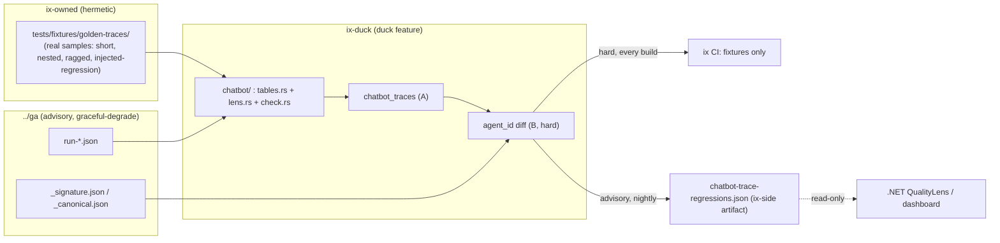

# Chatbot DuckDB flight recorder

## Enhancement Summary

**Deepened:** 2026-06-14 · 6 parallel agents (best-practices/DuckDB-SQL, architecture,
simplicity, performance, security, data-integrity), each grounded against the **real GA
corpus on disk**. Several findings *overturned* the first draft with measured evidence, so
those sections were revised (not merely annotated).

### Key changes from the first draft
1. **Scope cut to A + trimmed B (evidence-based).** Slice **E (cost) cut** — verified: GA
   traces carry only `elapsedMs`, *no token/usage field*, so cost would be fabricated.
   Slices **C (AFK) + D (reviews) deferred** — no recurring question; latency already lives
   in A's `elapsed_ms`. ~50% smaller v1, 100% of the stated core value.
2. **Gate redesigned (architecture P0 + security C1 — both critical).** The dual-checkout
   live-`ga` *merge* gate was an ownership inversion (ix `main` red for GA-owned data drift)
   **and** a fork-PR code-exec surface. Now: **hard gate = hermetic vendored fixtures only**
   (ix-owned, every build); **live-`ga` = nightly/advisory artifact**, never merge-blocking.
3. **Slice B hard signal = `agent_id`, not `response_length`.** Measured: an exact length
   diff false-flags day one (`explain-the-circle-of-fifths` canonical 3688 vs live 3882,
   +5.3%; `diatonic-chords-in-g-major` 649 vs 672 — both correct). Length → soft band.
4. **Reuse GA's own oracle.** GA already ships `_signature.json` (flattened
   `{name,status,agentId}`) and an `invariantAttributes` vs `rangeAttributes` split that
   *declares* what is exact vs banded. Read that instead of hardcoding a field list — and it
   likely eliminates the `canonicalSteps[]` list-lambda spike.
5. **DuckDB syntax corrected** (deprecated `->`, bracket access, `read_ndjson`, `TRY_CAST`,
   `sample_size=-1`); **CI keeps hermetic `bundled` + sccache** (prebuilt-libduckdb rejected on
   the blocking path — external SPOF + CI/local divergence); **contract right-sized** to a
   documented JSON shape (formal `.schema.json`/`provenance`/human-ack deferred to first
   consumer) with content-hash `baseline_ref` + fail-closed status kept.

### Post-technical-review trims (2026-06-14, second pass)
Verified the P0 (ownership inversion) and P1s (SQL-in-binary, contract location) are resolved.
Final trims applied: contract → documented JSON shape (defer formal schema); run-reducer →
single-run only (corpus is all `runCount:1`); `ga_root()` reframed as an explicit ix-streeling
`pub fn` edit (it doesn't exist yet) preserving `.`-root canonicalization; content-fingerprint
soft signal → Future Considerations; nightly asserts fixture-shape-vs-live (anti-staleness).

### New considerations discovered
- Multi-run reducer must be defined *now* (contract is one-way) even though the corpus is
  all `runCount:1` today (no `run-2.json` exists yet).
- Stale-baseline warn-not-fail + auto-derived canonicals = a Goodhart laundering trap →
  disambiguate by failure *fingerprint*, not count; hash-track + human-ack re-baselines.
- Phase 0 (`duck`-feature CI) should be its own small PR (surgical; it switches on CI for
  all existing ix-duck code at once).

---

## Overview

Add an **ix-side DuckDB analysis module** inside the existing `ix-duck` crate that turns the
GA chatbot's write-only golden-trace JSON into a queryable flight recorder (Slice A) plus a
**canonical-diff regression gate** (Slice B). It reads GA's on-disk artifacts under `../ga`
with graceful-degrade. GA's existing `state/quality/analytics/build-views.sql` /
`quality.duckdb` stays the **.NET-facing daily-aggregate** surface; this is the
**Rust/agent-facing per-run** reader over the same files — no second store, no service.

We already *produce* the traces; this makes them *answerable*, and stops agent-routing
regressions silently.

## Problem Statement

Chatbot-health questions are answered from memory because the richest signals sit in
un-queried per-run traces:

- **Weak intents** (scaleinfo ≈0.73, progressioncompletion ≈0.60) — anecdotal.
- **Latency outliers** (`modes` 64s) — invisible across runs.
- **Ungrounded answers** (`response.grounding = null`) — the hallucination surface, uncounted.
- **Routing-method drift** — untracked.
- The one tracked aggregate, `chatbot_qa.pass_pct`, is currently `null / degraded` — a weak,
  often-dead signal.

Data verified on disk 2026-06-14 (`../ga`, 45 prompts, 752 KB total, largest file 7 KB,
**all `runCount:1`**, all `rangeAttributes` empty):

| Source | Path (under `../ga`) | Shape |
|---|---|---|
| Golden traces | `state/quality/chatbot-qa/golden-traces/<id>/run-*.json`, `_canonical.json`, **`_signature.json`** | `response.{agentId,confidence,routingMethod,grounding,elapsedMs}`; canonical `canonicalSteps[]`; `_signature.json` = flattened `{name,status,agentId}` per step |
| AFK loop *(deferred C)* | `.../afk-runs/*.jsonl` | `{ts,run_id,kind,detail,det,sem,iteration}` |
| Reviews *(deferred D)* | `state/chatbot-reviews/*.json` | `{pr,branch,reviewedAt,reviewers[]}` |
| ~~Cost~~ *(cut E)* | `state/quality/ai-costs/pricing.json` | pricing only — **no token data in traces to join** |

## Proposed Solution

A `chatbot/` submodule in `ix-duck` (behind the opt-in `duck` feature) that owns **both** the
table builders **and** the named analysis queries as `pub fn`s; a thin example binary
`ix_chatbot_lens` (arg-parse + print only, like `ix_quality_lens.rs`) exposes two verbs:

- `lens` — print Slice A dev analyses.
- `check` — run Slice B gate over **vendored fixtures** (hard) and emit the JSON contract.

It resolves `../ga` via a **shared** `ga_root()` (extracted from `ix-streeling`,
override `--ga-root`/`GA_ROOT` → sibling default), degrading to `GaReport{present:false}`
(never `Err`). v1 = **A + trimmed B**, A first.

### Data flow



## Technical Approach

### Architecture

- **Home:** `crates/ix-duck/src/chatbot/` (`tables.rs`, `lens.rs`, `check.rs`, `model.rs`),
  `#[cfg(feature="duck")]` — mirrors `ix-streeling`'s `ingest`/`check`/`model` split. Both
  builders *and* analysis SQL live in the library; the example is a thin shell (fixes the
  "logic leaks into the binary" P1). A test asserts `check` builds its table via the *same*
  builder fn as `lens` → converts the parity claim into a `[T:test]` invariant.
- **Sibling resolution (explicit ix-streeling edit, not free reuse):** `ga_root()` does **not**
  exist today — `ix-streeling::default_roots` inlines `parent().join("ga")` inside a `Vec`
  builder. So this is a real refactor: add `pub fn ga_root(ix_root) -> PathBuf` to
  `ix-streeling` (a public-surface change — its own checklist item), have `default_roots` call
  it, and depend on that one function from ix-duck. **Preserve the `.`-root canonicalization**
  (`".".parent()` is `""` — `default_roots` canonicalizes first for exactly this). `--ga-root`/
  `GA_ROOT` is a **net-new** override convention (ix-streeling only has `--repo-root`); name it
  deliberately. Resolution modes tested: explicit-abs, explicit-rel, sibling-default (incl.
  `.`-as-root), absent.
- **Bench hardening (security H1/H2):** on the `open_bench()` connection,
  `SET enable_external_access=false; SET memory_limit='512MB';` and **enumerate + size/count-
  cap files in Rust** before handing an explicit file list to DuckDB (makes skip-with-count
  real per-file; blocks `://` roots, huge/nested JSON DoS). Prefer **bound parameters** for
  paths; only fall back to `.replace('\\','/').replace('\'',"''")` where a param can't bind,
  with a unit test feeding `'`, `--`, `/*`, `\`.

### DuckDB SQL specifics (verified against duckdb.org, v1.5.x — 2026)

```sql
-- Slice A: per-run warehouse. Nested STRUCT dot-paths; TRY_CAST + sample_size=-1 for drift.
SELECT prompt, category, recordedAt,
       response.agentId                         AS agent_id,
       TRY_CAST(response.confidence AS DOUBLE)  AS routing_confidence,
       response.routingMethod                   AS routing_method,
       response.grounding IS NOT NULL           AS grounding_present,
       TRY_CAST(response.elapsedMs AS BIGINT)   AS elapsed_ms,
       filename
FROM read_json_auto('<ga>/golden-traces/*/run-*.json',
                    filename=true, union_by_name=true, sample_size=-1);
```
- **Prefer `_signature.json` for Slice B's hard signal** — it is already a flattened
  `{name,status,agentId}` projection, so the expected agent needs **no list-lambda**. Only if
  reading `_canonical.json` directly, use the **current** lambda syntax (the `->` arrow is
  **deprecated**, removed in DuckDB v2.0) and **bracket** key access (works on STRUCT *and*
  MAP — the `invariantAttributes` bag may infer either):
  ```sql
  list_filter(canonicalSteps, lambda s : s.name = 'orchestration.answer')[1]
      .invariantAttributes['agent.id']   AS expected_agent_id   -- [1] is 1-based; empty→NULL
  ```
- **AFK jsonl (deferred C):** `read_ndjson('.../afk-runs/*.jsonl', ...)` (or
  `format='newline_delimited'`) — don't point the auto reader at jsonl.
- **Reviews (deferred D):** `FROM reviews t, UNNEST(t.reviewers) AS u(r)` — note an empty
  `reviewers[]` unnests to **0 rows** (use LEFT-style if PRs-without-reviewers must survive).

### Open question resolutions (from brainstorm + deepen)

1. **Trace-flattening → pure SQL, and likely no spike.** `_signature.json` supplies the hard
   `agent_id` signal flat. The `canonicalSteps[]` lambda is the fallback only; if used, spike
   it into a **test** that asserts the known agent is extracted (a DuckDB bump that breaks the
   syntax must fail loudly, not NULL-pass → green-but-dead). A NULL canonical agent = degraded,
   never pass.
2. **Cross-repo gate → hermetic hard gate + advisory live check (revised).** ix CI enforces
   only what ix owns: the **vendored-fixtures** diff (injected-regression must fail, happy
   must pass) inside the single `duck`-feature job. The live-`ga` corpus check runs **nightly
   / on-demand**, emits the contract as an **artifact**, and **never reds the merge queue**.
   This removes the ownership inversion *and* the fork-PR `pull_request_target` pwn surface in
   one move. If a live merge-gate is ever wanted, it belongs in GA's pipeline consuming the
   emitted contract (formats-not-coupling) — re-review trigger, logged as one-way door.
3. **Feed Streeling/learnings?** Out of scope; fast-follow.

### Slice B correctness (data-integrity)

- **Hard signal:** `agent_id` (+ `routing_method`, `status=completed` on `orchestration.answer`)
  — exact match. A routing flip is the real regression class.
- **Soft signal:** `response_length` only as a **band** (`abs(len-canon)/canon > 0.20`) → a
  `soft_flags[]` array / `status: warn`, never a hard fail. (Content-fingerprint similarity
  over `grounding.facts` is a v2 refinement — Future Considerations, not v1.)
- **Source of truth for exact-vs-banded:** read GA's `invariantAttributes` (exact) vs
  `rangeAttributes` (banded) split rather than a hardcoded list; flag back to GA that
  `response.length` is mis-filed under `invariantAttributes` (the live data proves it varies).
- **Run reducer — single-run only in v1 (corpus is 100% `runCount:1`; no `run-2.json` exists).**
  Emit `run_selection: "single"` (constant) and **reserve** the field; the majority/median
  policy is documented as unspecified-until-corpus-emits->1-run (additive later, no code/tests
  for a path no fixture can exercise).
- **degraded vs regression by *fingerprint*, not count** (operates fine on a single run set):
  homogeneous collapse (most flagged prompts → same fallback `agent_id`,
  `routing_method=fallback`, `grounding` null spike, `status=error/timeout`) ⇒ `degraded`
  (warn, exit 0). Heterogeneous flips ⇒ `regression` (fail). **Hard floor:** any single clean
  heterogeneous `agent_id` flip (grounding intact) ⇒ `regression` *regardless of count* —
  "many flagged" must never mask a real regression.
- **Anti-Goodhart re-baseline guard (cheap version):** `baseline_ref` = content hash of the
  canonical set compared against; a changed hash sets `baseline_changed: true` and the gate is
  **read-only** over canonicals (never regenerates them). Evaluated on the **ix-owned fixtures**
  path (so it stays ix-owned; the live-ga advisory path emits it informationally only). The
  human-ack workflow + prior-hash tamper-evidence retention are **deferred** until a contract
  history store exists to enforce against.

### Contract `chatbot-trace-regression` (v0.1 — documented JSON shape, no formal schema yet)

Write **ix-side** (`ix/state/quality/analytics/chatbot-trace-regressions.json`), never into
ga's tree. Atomic via `tempfile::NamedTempFile::persist` (Windows-safe replace; same-dir temp).
**No consumer exists yet**, so v1 ships a JSON shape *documented in the `.contract.md`* — the
formal `.schema.json` (`$schema`/`$id`/`additionalProperties`/`const`) + the `provenance{}`
block land in the **same PR that wires the first reader** (QualityLens), not before. **Minimum
shape now:** `status` ∈ `pass|regression|degraded|warn|skipped`, `run_at`, `run_selection`
(`"single"`), `prompts_checked`, `baseline_ref`(hash), `baseline_changed`,
`regressions[]{prompt_id,category,signal(agent_id|routing_method|status|response_length),
severity(hard|soft),expected,actual}`, optional `degraded_reason`.
**Exit-code map:** `regression`→nonzero; `pass|degraded|warn|skipped`→0 (note the projection
onto the repo's quality-gate-ledger `decision` enum: `regression→fail`, `skipped→skip`).
**Fail-closed:** unknown/missing status or a *read error when ga is present* ⇒ fail (distinct
from ga-absent → skip). Tolerate GA field drift by ignoring unknown keys (ledger `extra` ethos),
not by freezing. When the schema *is* formalized, locked fields = `status` enum, exit map,
`regressions[]` shape, `baseline_ref` semantics (GA-readable surface — needs GA ack, logged as
a one-way-door entry); freeze only at the named Phase-4 milestone.

## System-Wide Impact

- **Interaction graph:** read-only over fixtures (+ ga in the nightly path) → SQL → stdout +
  one ix-side JSON artifact. No GA-tree writes.
- **Error propagation:** absent ga → skip (exit 0); ga present but read errors → degraded/fail
  (not silent skip); malformed/oversized JSON → Rust-side enumerate+cap → skip-with-count;
  real heterogeneous regression → `regression` + nonzero (check path only).
- **State lifecycle:** atomic contract write; failed run leaves prior contract intact.
- **API parity:** `lens`/`check` share library builders — test-bound, not assumed.
- **CI gap fixed (separate PR):** `duck` is never built in CI today (no `--all-features`) →
  existing ix-duck code is unverified. A standalone Phase-0 PR adds the `duck` CI job.
- **Integration scenarios (real-shape):** happy 45-prompt corpus; absent ga → skip; injected
  `agent_id` regression → fail that prompt; homogeneous-failure fixture → degraded/warn;
  ragged + **oversized + deeply-nested** files → skip-with-count, no panic.

## Implementation Phases

### Phase 0 — `duck`-feature CI (SEPARATE PR, prerequisite)
- [ ] One ubuntu job, **keep hermetic `bundled`** (the hard gate is merge-blocking → no
      external-download SPOF, no CI-vs-local divergence; `Cargo.toml` already hardcodes
      `bundled` and switching it off would be a feature change). Tame the cold compile with
      **sccache (GHA backend)** + `Swatinem/rust-cache` `save-if: main` + `shared-key` + a
      weekly warm-keeper cron so the rarely-triggered path isn't perpetually cold. Run
      `cargo clippy -p ix-duck --all-targets --features duck -- -D warnings` +
      `cargo test -p ix-duck --features duck` + the `ix_chatbot_lens check` example in the
      **same** build (one DuckDB compile). Prebuilt-libduckdb is reserved as an optional speed
      lever for the **non-blocking nightly** job only.
- **Success:** CI compiles+tests `duck` hermetically; de-risks existing UDFs.

### Phase 1 — Slice A: trace warehouse + dev queries  *(highest leverage, build first)*
- [ ] `build_traces()` → `chatbot_traces(prompt_id,prompt,category,agent_id,routing_method,
      routing_confidence,grounding_present,response_length,elapsed_ms,recorded_at)`.
- [ ] Library `pub fn`s for: weak intents (`avg(confidence)<0.7`), latency outliers
      (`elapsed_ms`), ungrounded count (`grounding_present=false`), routing-method share.
      `lens` prints them; example stays a thin shell.
- [ ] Vendor real fixtures (≥3 shapes); test `traces_row_per_run`.
- [ ] `@ai:invariant chatbot_traces has one row per run file [T:test src:ix_duck::chatbot::tests::traces_row_per_run]`.
- **Success:** `lens` reproduces the known weak intents from real data.

### Phase 2 — Slice B (trimmed): agent_id gate + contract  *(hermetic hard gate)*
- [ ] Read `_signature.json` for the expected `agent_id` (fallback: `canonicalSteps[]` lambda,
      spiked into a test).
- [ ] `check_regressions()`: hard `agent_id` diff + soft length band; degraded-vs-regression
      by fingerprint; majority reducer; baseline content-hash + `baseline_changed`.
- [ ] Emit the v0.1 contract (ix-side, atomic, fail-closed) — documented JSON shape in
      `docs/contracts/chatbot-trace-regression.contract.md` (**no `.schema.json` until a
      consumer**).
- [ ] **ix CI hard gate over vendored fixtures only**; **separate nightly/on-demand** workflow
      for the live-ga advisory artifact (`on: schedule`/`workflow_dispatch`,
      `permissions: contents: read`, pinning matching the existing `ga-nightly-quality.yml`
      convention). The nightly also asserts **vendored-fixture shape still matches live GA
      shape** (so hermetic ≠ stale — guards the `_signature.json` fixture-staleness green-but-
      dead risk).
- [ ] Tests on real fixtures: `diff_flags_agent_drift`, `degrades_on_absent_ga`,
      `homogeneous_failure_is_degraded`, `single_clean_flip_fails`, `oversized_json_skipped`.
- [ ] `@ai:invariant` on the flagging rule + the `lens`/`check` shared-builder parity, test-bound.
- **Success:** injected-regression fixture fails; absent-ga skips; homogeneous-failure warns;
  baseline change requires ack.

### Phase 3 — Docs + wrap
- [ ] `docs/duckdb/chatbot-queries.sql`; cross-link `docs/DUCKDB.md`; note as the course's
      operational capstone.
- [ ] Write the DuckDB-nested-access (+ `_signature.json`) learning to `docs/solutions/`.
- [ ] Re-snapshot `state/assumptions/annotations.snapshot.json`.

## Alternative Approaches Considered

- **Full sweep A–E in v1.** Rejected on evidence: E has no token data on disk; C/D have no
  recurring question. Deferred/cut per simplicity + architecture reviews.
- **Dual-checkout live-ga *merge* gate in ix CI.** Rejected: ownership inversion + fork-PR
  code-exec surface. Replaced by hermetic-fixtures hard gate + advisory nightly.
- **`response_length` exact match.** Rejected: measured false-flags on correct answers.
- **Hardcoded exact/banded field list.** Rejected: GA's `invariantAttributes`/`rangeAttributes`
  already declares it.
- **`bundled` DuckDB in CI.** Rejected for the gate job: 8-16 min cold compile on a rarely-run
  (always-cold) path; download prebuilt libduckdb instead.
- **Rust pre-flatten / materialized `.duckdb`.** Deferred: corpus is 752 KB; in-memory + JSON
  contract suffices (perf review: data work is a non-issue; revisit only past ~thousands of run
  files).

## Acceptance Criteria

### Functional
- [ ] `lens` builds `chatbot_traces` and prints weak intents, latency outliers, ungrounded
      count, routing share over the real corpus.
- [ ] `check` flags `agent_id` regressions vs canonical (fingerprint-disambiguated), emits the
      fail-closed v0.1 contract, exits nonzero only on real `regression`.
- [ ] Absent ga → skip (exit 0); ga present + read error → degraded/fail.

### Quality gates
- [ ] All tests on **real** vendored fixtures (≥3 shapes incl. injected regression, oversized,
      homogeneous-failure); pass on ubuntu; Windows WDAC caveat documented.
- [ ] `cargo clippy -p ix-duck --all-targets --features duck -- -D warnings` clean.
- [ ] ix hard gate: red on injected-regression fixture, green on happy; nightly live job
      emits the artifact without blocking merges.
- [ ] `@ai:` invariants test-bound; `assumption-drift.yml` green; snapshot retaken.
- [ ] Codex P0/P1 fetched + addressed before merge.

## Success Metrics
- Weak-intent / ungrounded / latency questions each answerable by one query (baseline: 0).
- A seeded `agent_id` regression is caught by the hermetic gate **every build** (guardrail:
  the hard gate never depends on a sibling checkout, so it can't silently skip).

## Dependencies & Risks
- **Keep hermetic `bundled` + sccache on the blocking job** (bundled cold-compile is the only
  real cost; data work is negligible at 752 KB). Prebuilt-libduckdb was rejected for the
  merge-blocking path — it adds an external-download SPOF + CI-vs-local divergence; it's an
  optional lever for the non-blocking nightly only.
- **`duck` not in default CI** → Phase 0 PR lands first.
- **`_signature.json` shape** is the de-risk; confirm it carries the routed `agentId` before
  relying on it (else fall back to the spiked lambda).
- **Cross-repo schema drift** tolerated by `union_by_name`+`TRY_CAST`+`sample_size=-1`;
  contract is the coordination point (needs GA ack on locked fields).
- **Goodhart/laundering** mitigated by content-hash baseline + human-ack; **fork-PR/CI**
  surface removed by dropping the dual-checkout merge gate.
- **WDAC** may block `cargo test` binaries on Windows (smoke at session start).

## Future Considerations (fast-follow, demand-gated)
- Slice C (AFK telemetry), Slice D (review ledger) — when a recurring question appears.
- Slice E (cost) — only once traces emit a token count (GA-side change).
- Deep per-step UNNEST table; materialized `chatbot.duckdb` (consumer-driven, not perf);
  Streeling adapter (recurring regressions → learnings); chatbot × OPTIC-K join.
- A GA-side *merge* gate consuming the emitted contract, if/when wanted.
- Contract formalization (`.schema.json` + `$id`/`const`/`additionalProperties`, `provenance{}`,
  human-ack re-baseline + tamper-evidence) — wired in the first-consumer PR.
- Multi-run reducer (majority/median + `run_selection`) — when the corpus emits >1 run.
- Content-fingerprint soft signal (`grounding.facts` / token-set similarity) — v2 refinement.

## Sources & References

### Origin
- Brainstorm: [docs/brainstorms/2026-06-14-chatbot-duckdb-leverage-brainstorm.md](../brainstorms/2026-06-14-chatbot-duckdb-leverage-brainstorm.md).
  Carried forward: ix-duck home; formats-not-coupling; A+B tracer bullet. **Corrected by
  deepen:** scope trimmed (E cut, C/D deferred); gate is hermetic + advisory, not dual-checkout
  merge; `agent_id` (not length) is the hard signal.

### Internal references
- `crates/ix-duck/src/lib.rs` (`open_bench`/`open_readonly`, `@ai` test-binding);
  `examples/{yield_analysis,ix_quality_lens,ix_repl}.rs` (`read_json_auto` + thin-shell + path-escape).
- `crates/ix-duck/Cargo.toml`, `build.rs` (`duck` feature, `rstrtmgr`, `required-features`).
- `crates/ix-streeling/src/{lib.rs:default_roots, ingest.rs:skip-with-count, check.rs:seen_repos}` —
  the resolver to **reuse** + the repo-scoped degrade model.
- `.github/workflows/{streeling-freshness,ga-nightly-quality}.yml` — degrade-gate + fail-closed
  `jq` `case` patterns.
- `docs/contracts/{streeling-learning.schema.json, 2026-06-07-provenance-record.contract.md,
  2026-05-24-quality-gate-ledger.contract.md}` — contract conventions to mirror.
- GA: `state/quality/analytics/build-views.sql` (daily-aggregate; owns the canonical
  "degraded" semantics Slice B should reuse, not re-invent); `golden-traces/<id>/_signature.json`.

### Verified facts (deepen, on-disk)
- Traces carry only `elapsedMs` (no tokens) → E cut. `runCount:1` everywhere (no run-2) →
  reducer defined preemptively. `response.length` drifts on correct answers (3688→3882) → soft.
  All `rangeAttributes` empty (band mechanism exists, unused). DuckDB `->` lambda deprecated
  (v2.0 removal); bracket access works on STRUCT+MAP (duckdb.org/docs/current).

### Institutional learnings applied
- `power-of-two-test-masking` (real fixtures); `inharmonicity-estimator` oracle (structure not
  timing); `dogfood-yield-before-after` (per-run not cumulative); `headless-browser →
  data-contract-test`; `windows-app-control` (WDAC 4551).

### CLAUDE.md conventions
- Compose existing; formats-not-coupling; `@ai:` test-bound; green-but-dead guard; read Codex
  before merge; tracer-bullet vertical slices; surgical changes (Phase 0 split out).

## Implementation notes (v1 shipped 2026-06-14)

Built on `feat/chatbot-duckdb-flight-recorder`. Deviations from the plan, all toward
simplicity/surgical-changes (verified: `cargo test`/`clippy -p ix-duck --features duck` green;
lens + gate run on live `../ga` — 45 traces, 33/45 ungrounded, gate pass):
- **ix-streeling untouched.** The `ga_root()` extraction was dropped as scope-creep: the lib
  (`chatbot.rs`) takes `corpus_dir: &Path` (decoupled, testable); the example resolves the
  sibling/`GA_ROOT` inline. No cross-crate change.
- **Single `chatbot.rs`, not a `chatbot/` dir.** One cohesive ~480-line module is simpler than
  the streeling-style 4-file split at this size.
- **`_signature.json` + `UNNEST`** used for the hard signal — eliminated the `canonicalSteps[]`
  list-lambda *and* its `->`-deprecation risk entirely (no spike needed). `read_json_auto` takes
  an explicit Rust-enumerated file **list** (graceful-degrade + bounded input).
- **Contract = documented JSON shape** in the `.contract.md`; no `.schema.json` (no consumer
  yet). `provenance{}`, human-ack re-baseline, multi-run reducer all deferred per the trims.
- **Two workflows shipped in this PR** (not a split Phase-0 PR): `ix-duck-chatbot.yml` (hermetic
  hard gate, the only CI compiling `duck`) + `chatbot-trace-regression-nightly.yml` (advisory).
- Learning captured: `docs/solutions/feature-implementations/2026-06-14-duckdb-signature-unnest-over-lambda.md`.
