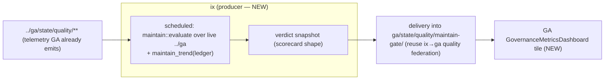

# GA maintain-verdict dashboard tile

> PRD produced by `/ask-matt → /grill-with-docs` (2026-06-20), grilling the question
> *"how can we leverage DuckDB+IX in the GA repo?"* against current reality. The grill
> **overturned** the first instinct (a GA-side PR gate) on codebase evidence — see
> [ADR-0002](../adr/0002-ga-consumes-maintain-verdict-not-an-ix-duck-gate.md).

## Problem / why

`ix-duck` already turns GA telemetry into answers (the five lenses + the `maintain` gate, all
merged). But the value is **trapped on the IX side**: ix emits a verdict, GA consumes nothing.
GA *does* already gate the per-signal surfaces natively (routing/shape/semantic — see ADR-0002),
so the gap is **not** another gate. The gap is the **fusion**: GA has no single cross-signal
"is the chatbot converging or regressing overall?" view. `ix-duck::maintain` produces exactly
that — one hexavalent **T/P/U/D/F/C** verdict over routing + ood + loops + chatbot — but it
isn't surfaced anywhere GA can see.

## What we're building

An **advisory dashboard tile** in GA's governance/quality dashboard showing the latest fused
`maintain` verdict, fed by a JSON snapshot in the existing `ga/state/quality/**` scorecard
convention. **Advisory, not a gate** (the verdict is non-binding until Phase-3b; ADR-0002).

## Non-goals (grilled out)

- ❌ A GA-side ix-duck **PR gate** — duplicates `CanonicalSignatureChecker` (agent_id/shape) +
  `semantic-regression-chatbot.yml` (answer drift); would import Rust into GA's .NET CI for no
  net signal. (ADR-0002.)
- ❌ Re-implementing any lens — all five + `maintain` are shipped.
- ❌ Writing into GA's tree from ix beyond the agreed snapshot path (formats-not-coupling).

## The chain (and the one missing link)

| Link | State today | Phase |
|---|---|---|
| **Producer** — IX runs `maintain::evaluate` over live `../ga` on a schedule and emits a verdict snapshot | ❌ no workflow; ledger has 5 manual lines | **A (tracer-bullet)** |
| **Delivery** — snapshot lands in `ga/state/quality/maintain-gate/…json` (scorecard shape) | ❌ unbuilt | **B** |
| **Tile** — GA dashboard renders the verdict | ❌ unbuilt | **C** |
| Constraint | verdict **advisory until Phase-3b** | — |

## Phases (vertical slices)

### Phase A — IX producer (the prerequisite tracer-bullet)
A tile reading an empty/stale ledger is green-but-dead, so this lands first and proves end-to-end.
- [ ] New workflow `maintain-gate-nightly.yml` (mirror `chatbot-trace-regression-nightly.yml`:
      `on: schedule`/`workflow_dispatch`, `permissions: contents: read`, hermetic `bundled`):
      check out ix + sibling `../ga`, run `maintain::evaluate` over live GA artifacts, append the
      ledger, and emit a **current-verdict snapshot** (latest verdict + `maintain_trend` summary)
      in the `ga/state/quality` scorecard shape (`timestamp`, `status`/metric, `summary`,
      `by_signal`).
- [ ] Small `ix-duck` helper (or extend the `ix_maintain_gate` example) to write the snapshot
      atomically (`tempfile::persist`), fail-closed, absent-ga → skip. Reuse `maintain_trend`.
- [ ] `@ai:invariant` + test that the snapshot matches the documented scorecard shape.
- **Success:** the nightly produces a fresh, schema-valid verdict snapshot from live GA data.

### Phase B — delivery into GA's scorecard surface
- [ ] Land the snapshot under `ga/state/quality/maintain-gate/<date>.json` (+ `last.json`) via the
      **existing ix→ga quality federation** (the same path `ix-quality-trend` / the quality
      snapshots already use). Confirm the exact mechanism (ix writes vs ga pulls) and reuse it —
      do **not** invent a new cross-repo channel.
- [ ] Document the `maintain-gate` snapshot in `ga/state/quality/_schema.json` (scorecard envelope).
- **Success:** GA's manifest/health-scorecard sees a `maintain-gate` entry, fresh daily.

### Phase C — GA dashboard tile
- [ ] Add a `maintain-gate` tile to GA's `GovernanceMetricsDashboard` (ReactComponents):
      hexavalent status chip (T/P/U/D/F/C → colour), the four sub-signals (routing/ood/loops/
      chatbot ok?), `metric_delta`, and an **"advisory"** badge.
- [ ] Crossover-skip / dev-data fixture so the tile renders before the first live snapshot
      (no green-but-dead empty tile).
- **Success:** the dashboard shows the live fused verdict with the advisory badge.

## Contract

Reuse `docs/contracts/maintain-gate.contract.md` (verdict shape, hexavalent status, exit map)
+ the GA scorecard envelope (`ga/state/quality/_schema.json`). The snapshot is the
**`maintain-gate.v0.1`** verdict + a `maintain_trend` summary, in scorecard shape. Locked fields
(status enum, sub-signal keys) need GA ack — log as a one-way-door entry when GA's tile depends
on them. Formats-not-coupling; no Rust in GA CI.

## Cross-repo / ownership
- **IX owns** the producer + the verdict semantics.
- **GA owns** the tile + the scorecard envelope.
- Joined only by the snapshot file contract. This is a **two-repo build** → issues land on both
  `GuitarAlchemist/ix` (Phase A/B-producer) and `GuitarAlchemist/ga` (Phase B-target/C).

## Risks
- **Green-but-dead** — the #1 risk; mitigated by Phase A landing first + the dev-data fixture +
  a freshness check on the snapshot (stale → tile shows "stale", not a fake green).
- **Advisory-only** — the tile must say so; don't let it read as a pass/fail gate.
- **Delivery mechanism unknown** — Phase B's first task is to *confirm* the existing federation
  path, not assume it.
- **Bundled-DuckDB compile** in the nightly — non-blocking job; cache (sccache + rust-cache)
  per the existing `ix-duck-chatbot.yml` convention.

## Acceptance criteria
- [ ] Nightly emits a fresh, schema-valid maintain verdict snapshot from live GA data (Phase A).
- [ ] Snapshot reaches `ga/state/quality/` via the existing federation; appears in the manifest (B).
- [ ] GA dashboard renders the hexavalent verdict + sub-signals + advisory badge; degrades to a
      fixture/"stale" state, never a fake green (C).
- [ ] ADR-0002 referenced; `@ai:` invariants test-bound; Codex P0/P1 fetched before each merge.

## Sources
- Grill thread 2026-06-20 (`/ask-matt → /grill-with-docs`); origin brainstorm
  `docs/brainstorms/2026-06-14-chatbot-duckdb-leverage-brainstorm.md`; completed predecessor
  `docs/plans/2026-06-14-004-…-flight-recorder-plan.md` (ix-side, shipped).
- ADR: `docs/adr/0002-ga-consumes-maintain-verdict-not-an-ix-duck-gate.md`.
- Evidence: GA `CanonicalSignatureChecker.cs`, `compare-trace-to-canonical.ps1`,
  `semantic-regression-chatbot.yml` (GA already gates per-signal); `ix-duck::maintain` +
  `maintain_trend` (the fusion); `docs/contracts/maintain-gate.contract.md` (advisory-until-Phase-3b).
