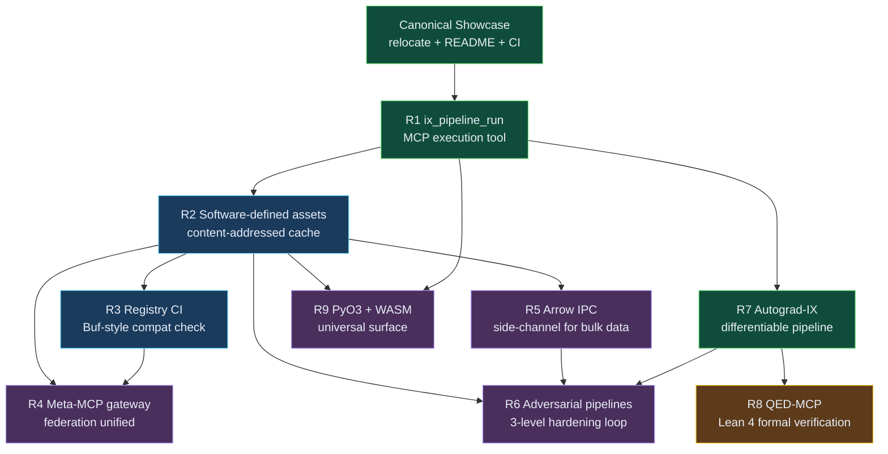

# IX Roadmap Plan v1 — R1-R9 + Canonical Showcase

**Document status:** authoritative consolidation of the improvement investigation, the next-horizon brainstorm, and the R7 code-first review. Supersedes nothing — the three source documents remain the detailed references.

**Source documents:**
- `target/demo/improvement-investigation-ix-v1.md` — R1-R6 and canonical showcase (§10)
- `target/demo/brainstorm-next-horizon-ix.md` — R7, R8, R9 with convergence themes
- `target/demo/r7-autograd-codex-review.md` — merged Codex + Claude code review with 5-day R7 schedule

**Date:** 12 April 2026
**Revision:** v1 (initial consolidation)
**Scope:** technical roadmap only. No team sizing, budget approval, release notes, marketing, or multi-region deployment concerns.

---

## 1. Executive one-pager

### The plan in one paragraph

Ship the IX workspace from *a collection of 46 isolated MCP tools hand-chained by language models* to *a compositional, auditable, federated, self-hardening math/ML platform* over roughly six calendar months. The path goes through nine engineering recommendations (R1-R9) plus one organizational recommendation (relocate and promote `target/demo/` to a first-class canonical showcase). The work is fully sequenced and the first concrete action can start immediately.

### Effort and calendar

| Horizon | Work items | Dev-weeks | Calendar | Status |
|---|---|---|---|---|
| Phase 1 — Foundation | Showcase relocation, R1 ix_pipeline_run, R7 Autograd prototype, R2 begin | 4 weeks | Weeks 1-4 | Ready to start |
| Phase 2 — Composability | R2 complete, R3 registry CI, R7 full implementation | 4 weeks | Weeks 5-8 | Blocked by Phase 1 |
| Phase 3 — Federation + breadth | R4 gateway, R5 Arrow side-channel, R6 adversarial loops, R9 PyO3 bridge | 5 weeks | Weeks 9-13 | Blocked by R2, R3 |
| Phase 4 — Proof + universal surface | R8 formal verification MVP, R9 WASM surface | 8-10 weeks | Weeks 14-24 | Blocked by Phase 3 |
| **Total** | **9 recommendations + showcase** | **21-23 dev-weeks** | **~24 calendar weeks** | |

Calendar is longer than dev-weeks because of decision gates, validation windows, and the assumption that nobody runs at 100% utilization.

### Top three risks

1. **Scope creep inside each recommendation.** R6 alone has three levels (surrogate adversarial, co-evolution, persona); R9 has two surfaces (Python and WASM). Treating any of them as unbounded will burn a phase. Mitigation: each recommendation has an explicit MVP success criterion in §3 below and each phase has a decision gate in §7.
2. **R7 Autograd correctness, specifically FFT backward.** The Codex+Claude review flagged Hermitian-mirror edge cases (DC bin, Nyquist) that silently produce 2× gradient errors on specific bins. One bad day on Day 4 of the R7 prototype can invalidate the go/no-go measurement on Day 5. Mitigation: feature-flag FFT (`fft-autograd`), move it to Day 5, and be willing to ship Week 1 without it.
3. **Single-developer bus factor.** IX is a solo-dev-size workspace today. A six-month roadmap with one engineer is a single-point-of-failure roadmap. Mitigation: every recommendation must produce documentation for a second engineer to understand what was built *and why* — this is enforced by the "validation via showcase demo" field in §3.

### First week's definition of done

At end of week 1, all of the following must be true:
- `examples/canonical-showcase/` exists in git, contains the relocated `target/demo/` artifacts, and has a top-level `README.md` with a tool × demo matrix.
- `crates/ix-autograd/` exists with `Cargo.toml`, `src/lib.rs`, tape + core primitive ops (add, mul, sum, matmul), and `ExecutionMode::{Eager, Train, Mixed, VerifyFiniteDiff}`.
- `crates/ix-autograd/tests/finite_diff.rs` exists and passes for all implemented primitives to 1e-5 tolerance.
- `ix_linear_regression` is wrapped as a `DifferentiableTool` with both `forward` and `backward` implementations verified by the finite-diff harness.
- A standalone demo binary minimizes the variance of a 2-tool pipeline (linreg → variance) via Adam on the autograd tape.
- Measured speedup vs `ix-evolution` GA baseline is recorded in a `r7-prototype-results.md` file.

### Go/no-go decision gate after week 1

**Gate criteria at the end of week 1:**
- Gradient-Adam must converge to the same objective minimum as the `ix-evolution` GA baseline.
- In ≥ 20× fewer objective evaluations.
- AND in ≥ 10× less wall-clock time.
- AND the finite-diff verifier must pass on all wrapped tools to 1e-5.

**Gate outcomes:**
- **All four met** → commit to R7 full implementation in Phase 2, proceed to week 2 R1 work as planned.
- **First three met, verifier partial** → fix verifier gaps in week 2 before proceeding, R7 still on track.
- **Convergence OK but speedup < 20×** → downgrade R7 from "first-class pipeline mode" to "specialized differentiable sub-pipeline", keep R1 on track, re-evaluate R7 scope at week 4.
- **Convergence fails** → R7 is archived, roadmap drops from R1-R9 to R1-R6 + R8 + R9, Phase 1 is shortened by 3 weeks.

---

## 2. Dependency graph



### Critical path

The critical path (longest chain of strict dependencies) is:

**Showcase → R1 → R2 → R3 → R4 → R6**

Everything else hangs off this spine. R7 runs in parallel with R1-R2 because the autograd crate does not block the pipeline execution tool. R8 waits for R7 (verification of an opaque pipeline is a weaker story than verification of a differentiable one). R9 waits for R1 (you can't expose a Python binding to a pipeline tool that doesn't exist yet) and R2 (the catalog surface is more useful when assets are named).

### Parallelizable branches

- **Branch A (R7 Autograd)**: can start on Day 1 in parallel with the showcase relocation and R1, because the autograd crate is self-contained. Gate at end of week 1.
- **Branch B (R9 PyO3 bindings)**: can start as soon as R1 is shipping in week 2. Gets ~3 weeks of parallel work with R2.
- **Branch C (R9 WASM surface)**: independent of R9 PyO3; can be slotted into Phase 3 or Phase 4 based on capacity.
- **Branch D (R3 registry CI)**: once R2's asset naming is stable, R3 can proceed without waiting for R2's cache implementation. Parallel with R4 early work.

---

## 3. Work items

Each recommendation is scoped to a shippable unit with a concrete success criterion and a validation demo drawn from the canonical showcase.

### Canonical Showcase — relocation and promotion

- **Source:** `improvement-investigation-ix-v1.md` §10
- **Scope:** move `target/demo/` to `examples/canonical-showcase/` so it is git-tracked, survives `cargo clean`, and becomes a first-class artifact of the project. Add `README.md` with a tool × demo matrix, reproduction instructions, and links to the reports. Structure the folder as a progressive tutorial (01-cost-anomaly-hunter → 05-ix-self-improvement). Add a CI job that regenerates each demo on every push to main and diffs against golden files.
- **Effort:** 3 dev-days
- **Success criterion:** `examples/canonical-showcase/README.md` exists, all 10 current demo files are git-tracked under that directory, CI job regenerates at least one demo (cost-anomaly-hunter is the lightest) from a YAML pipeline spec, `cargo clean` does not delete any artifact.
- **Validation demo:** itself — the showcase folder is its own validation.
- **Dependencies:** none (can start Day 1)
- **Risk:** low. Mitigation: use `git mv` to preserve history, test on a branch before merging to main.
- **Owner:** _TBA_

### R1 — `ix_pipeline_run` MCP tool

- **Source:** `improvement-investigation-ix-v1.md` §4.1
- **Scope:** expose a new MCP tool in `ix-agent` with the input schema `{ spec: PipelineSpec, inputs: map, seed?: u64, cache?: "none" | "disk" }`. Handler deserializes the YAML spec via the existing `lower.rs`, calls `executor::execute()` with a concrete `PipelineCache` implementation backed by `ix-cache`, and serializes the resulting `PipelineResult`. Add `ix_pipeline_list` tool that lists YAML pipelines under a conventional `pipelines/` directory. Migrate the four existing demo scenarios (`chaos_detective`, `cost_anomaly_hunter`, `governance_gauntlet`, `sprint_oracle`) from hardcoded `DemoStep` arrays to `.pipeline.yaml` files.
- **Effort:** 5-8 dev-days
- **Success criterion:** a single MCP call to `ix_pipeline_run` with the `cost_anomaly_hunter.pipeline.yaml` produces bit-identical output to the current hand-chained demo. All four demo scenarios migrated. Integration test passes.
- **Validation demo:** `01-cost-anomaly-hunter/pipeline.yaml` replays via one MCP call.
- **Dependencies:** canonical showcase relocation (so YAML files have a home).
- **Risk:** moderate. Mitigation: keep the old `DemoStep`-based demo scenarios as a parallel code path until the YAML variant is proven bit-identical.
- **Owner:** _TBA_

### R2 — Software-defined assets with content-addressed cache

- **Source:** `improvement-investigation-ix-v1.md` §4.2
- **Scope:** extend `PipelineNode` with `asset_name: Option<String>`. When set, the cache key becomes `blake3(asset_name + code_version + hash(resolved_inputs))`. Provide `IxCachePipelineCache` as a concrete implementation of `PipelineCache` backed by `ix-cache`. Add a lineage field to `NodeResult`: `upstream_hashes: Vec<[u8; 32]>`. Surface `PipelineResult::lineage()` returning a DAG of provenance consumable by `ix_governance_check`. Follows Dagster's software-defined assets pattern and Nextflow's content-addressed work directories.
- **Effort:** 10-15 dev-days
- **Success criterion:** a second invocation of any canonical showcase demo hits the cache and is ≥ 10× faster than the first. `PipelineResult::lineage()` returns a DAG that `ix_governance_check` can audit. All 10 canonical demos still pass bit-identical output.
- **Validation demo:** `01-cost-anomaly-hunter` replayed twice — second time must report cache hits for every node.
- **Dependencies:** R1 (`ix_pipeline_run` must exist before it can cache).
- **Risk:** moderate. Mitigation: keep cache behaviour opt-in via `cache: "disk" | "none"` on the spec; default to `none` until Week 4 validation passes.
- **Owner:** _TBA_

### R3 — Registry CI with Buf-style compatibility checks

- **Source:** `improvement-investigation-ix-v1.md` §4.3
- **Scope:** extend `governance/demerzel/schemas/capability-registry.json` so every tool entry carries `{name, version, input_schema, output_schema, owner_repo, since_version, breaking_changes[]}`. Write a Rust checker crate (~300 LOC) or extend `ix-registry` to detect backward-incompatible changes between old and new registry files: removing required fields, renaming fields, changing types, tightening enums. Wire the checker into a GitHub Actions job in the `demerzel` submodule repo that blocks the CI on breaking changes unless explicitly allowlisted.
- **Effort:** 6-8 dev-days
- **Success criterion:** deliberately renaming `ix_stats.mean` → `ix_stats.mu` in a test branch blocks CI with a clear error. The error message identifies the offending tool, the breaking change type, and the allowlist mechanism.
- **Validation demo:** new CI test file `tests/registry-breaking-change.yml` that introduces an incompatible change and asserts CI blocks.
- **Dependencies:** R2 (asset naming must be stable before registry CI can enforce contracts on them — otherwise the checker will thrash on every asset refactor).
- **Risk:** low. Mitigation: start with strict mode off (warnings only) for two weeks, then flip to hard-block.
- **Owner:** _TBA_

### R4 — Meta-MCP gateway

- **Source:** `improvement-investigation-ix-v1.md` §4.4
- **Scope:** new crate `demerzel-gateway` (dispatched decision: lives in IX workspace, could move to demerzel repo later) that connects to the three downstream MCP servers (ix, tars, ga), aggregates their `tools/list` responses with repo prefixing (`ix__tool_name`, `tars__tool_name`, `ga__tool_name`), routes incoming calls to the right downstream, and intercepts every call for Demerzel audit via `ix_governance_check`. Update `.mcp.json` in the showcase to reference a single entry point.
- **Effort:** 10-12 dev-days
- **Success criterion:** a client registers only `demerzel-gateway` and can successfully call tools from all three repos through it. Every gateway call appears in the Demerzel audit trail. Name collisions between repos are handled mechanically (no silent shadowing).
- **Validation demo:** a new `examples/canonical-showcase/04-catia-bracket-generative/` variant that runs through the gateway and produces bit-identical output to the direct MCP variant.
- **Dependencies:** R2 (asset names feed into the audit trail), R3 (schemas must be stable before the gateway can validate them at routing time).
- **Risk:** moderate. Mitigation: gateway must support a pass-through mode that does not require schema validation, for emergency rollback.
- **Owner:** _TBA_

### R5 — Arrow IPC side-channel

- **Source:** `improvement-investigation-ix-v1.md` §4.5
- **Scope:** add a transport annex: if a tool output exceeds 64 KB serialized, write it as Arrow IPC to `state/artifacts/<sha256>.arrow` and return `{arrow_ref: "sha256:..."}` in the JSON-RPC response. Clients resolve refs via local file reads or a route in `ix-agent`. Primary consumer: bracket-class demos with 10⁶+ data points that currently cannot flow through JSON-RPC.
- **Effort:** 10-15 dev-days
- **Success criterion:** a synthetic variant of `04-catia-bracket-generative` with 10⁶ load cases completes without JSON payload explosion. Latency impact < 15% on the reference bracket demo (64 KB threshold is correctly tuned).
- **Validation demo:** `examples/canonical-showcase/04-catia-bracket-generative/stress-test/` variant with oversized inputs.
- **Dependencies:** R2 (refs need an asset identity to serve as the key), R1 (pipeline execution must be the thing emitting refs).
- **Risk:** moderate. Mitigation: Arrow Rust bindings are mature; F# and C# support is via Arrow .NET which is also available.
- **Owner:** _TBA_

### R6 — Adversarial pipelines (three levels)

- **Source:** `improvement-investigation-ix-v1.md` §9 (R6 addendum)
- **Scope:** three levels implementable independently:
  - **Level 1 — Adversarial surrogate validation.** Wrap every ML surrogate (random forest, NN, linear regression) with a mandatory `:adversarial_validation` sibling asset. Uses `ix_adversarial_fgsm` to find worst-case inputs, retrains on them, iterates. Target: surrogate trap mitigation.
  - **Level 2 — Designer vs breaker co-evolution.** Two `ix-evolution` populations. Designer proposes pipeline configurations, breaker proposes stressors. Mixed Nash equilibrium via `ix_game_nash`. Produces a fleet of ~10 Pareto-optimal pipelines, each robust to a different threat profile.
  - **Level 3 — Adversarial-auditor Demerzel persona.** New persona YAML in `governance/demerzel/personas/`. Active chaos engineering on pipeline logic via OOD inputs, cache saturation, constitutional violation attempts. Scored by `ix_governance_check`. Survival unlocks autonomy levels per the alignment policy.
- **Effort:** L1 3-4 days, L2 1-2 weeks, L3 ~1 week. Total 3-4 weeks.
- **Success criterion:** L1 discovers and patches ≥ 3 failure modes on the bracket surrogate before convergence. L2 produces a Pareto fleet with measurable diversity. L3 runs the bracket pipeline through 100 adversarial audits and reports a survival rate.
- **Validation demo:** `04-catia-bracket-generative` runs L1 and proves the stress margin is ≥ 1.45 under the worst adversarial input found.
- **Dependencies:** R1, R2 (deterministic replay), R5 (large adversarial batch runs), R7 (gradient-adversarial is superior to evolutionary-adversarial for L1).
- **Risk:** moderate. Mitigation: L1 only ships with the MVP; L2 and L3 are follow-ons gated on L1 success.
- **Owner:** _TBA_

### R7 — Autograd-IX

- **Source:** `brainstorm-next-horizon-ix.md` §3 R7, `r7-autograd-codex-review.md` entire file
- **Scope:** differentiable programming across the IX pipeline graph via a new `crates/ix-autograd/` crate. Build **scratch over ndarray** (not candle, not burn, not dfdx — per Codex code review). Reverse-mode Wengert tape, dynamic (not type-level generic). Explicit `forward` + `backward` trait methods on `DifferentiableTool`. `ExecutionMode::{Eager, Train, Mixed, VerifyFiniteDiff}` threaded through the pipeline executor. Hermitian-mirror FFT backward with DC and Nyquist edge cases (feature-flagged behind `fft-autograd` for Week 1 prototype).
- **Effort:** 5 dev-days for the prototype, 6-8 weeks for the full implementation gated on prototype success.
- **Success criterion:** prototype — gradient-Adam converges to the same objective as `ix-evolution` GA in ≥ 20× fewer evaluations and ≥ 10× less wall-clock on a 2-3 tool chain. Full implementation — ≥ 10 of the 46 current MCP tools wrapped as `DifferentiableTool`, all passing finite-diff verification to 1e-5, and `04-catia-bracket-generative` runs end-to-end in gradient mode.
- **Validation demo:** `examples/canonical-showcase/06-autograd/` — new demo dedicated to R7.
- **Dependencies:** none for the prototype. R1 helpful but not required (autograd operates on the DAG, not on MCP calls per se).
- **Risk:** high. See §6 risk register entries for FFT numerical mismatch, Mixed-mode boundary bugs, scope creep.
- **Owner:** _TBA_

### R8 — QED-MCP (Lean 4 / Kani formal verification)

- **Source:** `brainstorm-next-horizon-ix.md` §3 R8
- **Scope:** new crate `ix-verify` bridging IX pipelines to Lean 4 or Kani for formal property verification. Narrow-domain MVP: prove non-negative mass, non-exceedance of yield stress for bracket-class pipelines. Later expansion to general property verification. Wire verification results into `ix_governance_check` as a constitutional pre-check.
- **Effort:** 3 months for narrow domain, 9 months for general.
- **Success criterion:** the bracket pipeline can be proven (machine-checked proof artifact) to satisfy "max von Mises stress < 950 MPa under all 20 load cases" for a given parameter vector.
- **Validation demo:** `examples/canonical-showcase/04-catia-bracket-generative/` gains a `proof/` subdirectory with Lean artifacts.
- **Dependencies:** R7 (verification of a differentiable pipeline is much stronger than verification of an opaque one; Lean 4 has a mature differentiable-tensor library worth leveraging).
- **Risk:** high. Mitigation: stay scoped to narrow domain for Phase 4; general property verification is explicitly a Phase 5+ concern.
- **Owner:** _TBA_

### R9 — PyO3 bridge + IX-Playground WASM

- **Source:** `brainstorm-next-horizon-ix.md` §3 R9
- **Scope:** two surfaces under one recommendation because they compound.
  - **R9a — PyO3 bridge.** New crate `ix-py` using `maturin`. Expose ~20 core MCP tools as Python functions. Arrow interop for polars/pandas dataframes. Publish as a package.
  - **R9b — WASM surface.** New crate `ix-wasm` using `wasm-bindgen`. Compile `ix-math`, `ix-grammar`, `ix-number-theory` to WASM. Browser REPL with visual pipeline composition.
- **Effort:** R9a 2-3 weeks, R9b 3 weeks. Total ~5 weeks.
- **Success criterion:** `pip install ix-py` works, `import ix; ix.stats([1,2,3])` returns the expected result. Browser REPL runs `cost_anomaly_hunter` pipeline entirely client-side.
- **Validation demo:** two new demos — `examples/canonical-showcase/07-python-bridge/` and `examples/canonical-showcase/08-wasm-playground/`.
- **Dependencies:** R1 (there must be a pipeline run tool for Python to bind to), R2 (named assets make the Python API discoverable).
- **Risk:** moderate. Mitigation: scope R9a MVP to 10 tools in the first pass; expand coverage incrementally.
- **Owner:** _TBA_

---

## 4. Sequence and phasing

### Phase 1 — Foundation (weeks 1-4)

**Goals:** unblock everything else. Make a demo reproducible from a single MCP call. Prove autograd is worth pursuing.

**Work items:**
- Canonical Showcase relocation (Week 1, 3 days, background)
- R1 `ix_pipeline_run` (Week 2, 5-8 days)
- R7 Autograd prototype (Week 1, 5 days) → Week 1 go/no-go gate
- R2 asset-name field and cache skeleton (Weeks 3-4, 10-15 days)

**Decision gates:**
- **End of Week 1:** R7 go/no-go (see §1 criteria). If no-go, Phase 1 shortens and R7 is archived.
- **End of Week 2:** R1 shipped. At least one demo reproducible from YAML. If not, Phase 1 extends.
- **End of Week 4:** R2 shipped. Cache hit rate ≥ 90% on demo replays. Phase 1 complete.

### Phase 2 — Composability (weeks 5-8)

**Goals:** make IX pipelines reproducible, audit-logged, and schema-checked. Complete R7 if the prototype succeeded.

**Work items:**
- R2 completion: lineage tracking and audit trail (Weeks 5-6)
- R3 registry CI (Weeks 5-6, parallel with R2 completion)
- R7 full implementation (Weeks 5-8 if prototype succeeded)

**Decision gates:**
- **End of Week 6:** R3 shipped. Intentional breaking changes in a test branch block CI.
- **End of Week 8:** R2 and R3 fully shipped. R7 has wrapped ≥ 10 tools. Phase 2 complete.

### Phase 3 — Federation and breadth (weeks 9-13)

**Goals:** unify the three-repo federation under one gateway, unlock bulk data flows, harden pipelines with adversarial validation, open the Python door.

**Work items:**
- R4 meta-MCP gateway (Weeks 9-10, 10-12 days)
- R5 Arrow IPC side-channel (Weeks 9-11, 10-15 days, parallel with R4)
- R6 adversarial pipelines L1 (Weeks 11-12, 3-4 days)
- R9a PyO3 bridge (Weeks 10-12, 15 days parallel)
- R6 L2 and L3 (Weeks 12-13, 2-3 weeks)

**Decision gates:**
- **End of Week 10:** R4 gateway routes calls across all three MCP servers with audit logs.
- **End of Week 11:** R5 handles 10⁶-element arrays without JSON bloat. R6 L1 is wired into the bracket demo.
- **End of Week 13:** R6 L2 + L3 shipped. R9a PyO3 MVP installable via pip. Phase 3 complete.

### Phase 4 — Proof and universal surface (weeks 14-24)

**Goals:** formal verification of narrow-domain pipeline properties. Expand the WASM surface. Soft-launch the public canonical showcase.

**Work items:**
- R8 formal verification narrow-domain MVP (Weeks 14-20, ~6 weeks)
- R9b WASM surface (Weeks 14-16, parallel with R8 early phase)
- Canonical showcase public launch, GitHub Pages (Week 17)
- R8 narrow-domain proof-of-concept for the bracket demo (Weeks 18-20)
- Buffer and polish (Weeks 21-24)

**Decision gates:**
- **End of Week 16:** R9b WASM MVP in-browser demo runs.
- **End of Week 20:** R8 produces a machine-checked proof artifact for the bracket stress property.
- **End of Week 24:** everything on the roadmap is shipped or explicitly deferred to Phase 5.

---

## 5. Week-by-week plan for Phase 1 (weeks 1-4)

Phase 1 is the most detailed because it is the highest-risk period and because every subsequent phase depends on it.

### Week 1 — Foundation and R7 prototype

| Day | Focus | Deliverable | Dependency |
|---|---|---|---|
| **Mon** | `crates/ix-autograd/` scaffold. Types: `Tensor`, `TensorData::F64(ArrayD<f64>)`, `Tape`, `DiffContext`, `TensorHandle`. Core primitive ops: `add`, `mul`, `sum`, `matmul` (forward + backward). Define `ExecutionMode::{Eager, Train, Mixed, VerifyFiniteDiff}`. | ~600 LOC across `lib.rs`, `tape.rs`, `tensor.rs`, `ops.rs`, `mode.rs` | none |
| **Mon (background)** | `git mv target/demo/ examples/canonical-showcase/`. Write minimal `README.md` with navigation to the 10 artifacts. | Showcase folder in main branch | none |
| **Tue** | Finite-diff verifier in `crates/ix-autograd/tests/finite_diff.rs`. Must be runnable on any `DifferentiableTool` with one function call. Verifies `add`, `mul`, `sum`, `matmul` against `(f(x+ε) − f(x−ε))/(2ε)` to 1e-5 tolerance. | ~200 LOC verifier + 4 passing tests | Monday's ops |
| **Tue** | Wrap `ix_linear_regression` as `DifferentiableTool` with explicit `forward` and `backward`. Verify with the harness. | 1 tool wrapped, verifier passes | Tuesday's verifier |
| **Wed** | Wrap `ix_stats::variance` (mean-of-square-diffs, trivially differentiable). Chain linreg → variance as a 2-node `Tape`. Verify end-to-end gradient via harness. | 2 tools wrapped, 2-node chain working | Tuesday's wrap |
| **Wed** | Implement training loop using `ix-optimize::Adam` on the autograd tape. Minimize variance by adjusting linreg bias. Record iteration count, final variance, wall-clock. | Standalone demo binary | Wednesday's chain |
| **Thu** | Harden: shape broadcasting for matmul edge cases, error reporting with actionable messages, `HashMap<String, Value>` ↔ tensor boundary conversions. | Error types cleaned up, 3-tool chain possible | Wednesday's demo |
| **Thu** | Benchmark: re-run the same variance-minimization objective using `ix-evolution` GA as a baseline. Record iterations, wall-clock. | `benchmarks/r7-baseline.txt` with GA numbers | Thursday's hardening |
| **Fri AM** | FFT behind `fft-autograd` feature flag. Implement Hermitian-mirror backward with DC and Nyquist edge cases per Codex review. Verify against JAX `jnp.fft.rfft` gradient (reference values hard-coded in test). | Optional FFT support, test passing | Thursday's chain |
| **Fri PM** | **Go/no-go measurement and report.** Write `target/demo/r7-prototype-results.md` with: iteration counts, wall-clock times, speedup factor, finite-diff pass rate, go/no-go recommendation. | Decision gate document | Everything from Week 1 |

### Week 2 — R1 `ix_pipeline_run`

| Day | Focus | Deliverable |
|---|---|---|
| **Mon** | Design `ix_pipeline_run` input schema. Wire handler in `ix-agent/src/tools.rs` and `handlers.rs`. Handler deserializes via existing `lower.rs`, calls `executor::execute()`, serializes `PipelineResult`. | Handler skeleton, unit tests |
| **Tue** | Implement `IxCachePipelineCache` as concrete `PipelineCache` backed by `ix-cache`. Integrate with the handler. | Cache implementation, cache-hit test |
| **Wed** | Migrate `cost_anomaly_hunter` demo scenario from hardcoded `DemoStep` array to `examples/canonical-showcase/01-cost-anomaly-hunter/pipeline.yaml`. Run via `ix_pipeline_run`. Assert bit-identical output to the hand-chained version. | 1 demo migrated, regression test |
| **Thu** | Migrate `chaos_detective` and `governance_gauntlet` demos. | 3 demos migrated total |
| **Fri** | Migrate `sprint_oracle`. Add `ix_pipeline_list` tool that lists pipelines under `examples/canonical-showcase/**/pipeline.yaml`. Update the tool × demo matrix in `examples/canonical-showcase/README.md`. | 4 demos migrated, list tool working |

### Week 3 — R2 software-defined assets (part 1)

| Day | Focus | Deliverable |
|---|---|---|
| **Mon** | Extend `PipelineNode` with `asset_name: Option<String>`. Plumb through `PipelineSpec` YAML parser. | `asset_name` supported end-to-end |
| **Tue** | Cache key derivation: `blake3(asset_name + code_version + hash(resolved_inputs))` when `asset_name` is set. Fall back to current behaviour otherwise. | New cache key logic, tests |
| **Wed** | Lineage field: extend `NodeResult` with `upstream_hashes: Vec<[u8; 32]>`. Track upstream hashes during execution. | Lineage captured per node |
| **Thu** | `PipelineResult::lineage()` method returning a DAG of provenance. Format: `serde_json::Value` for now, a typed graph later. | Lineage API |
| **Fri** | Integration test: run `01-cost-anomaly-hunter` twice, assert second run hits the cache for every node. Measure speedup. | Cache-hit metric recorded |

### Week 4 — R2 completion and R7 go/no-go resolution

| Day | Focus | Deliverable |
|---|---|---|
| **Mon** | Wire `PipelineResult::lineage()` into `ix_governance_check`. The checker can now audit which upstream assets contributed to a decision. | Lineage visible in Demerzel audit trail |
| **Tue** | Performance: profile the cache path, tune blake3 vs sha256 if needed (blake3 should win handily). Ensure cache hit rate is ≥ 90% on full replays of all 4 migrated demos. | Benchmark report in `target/demo/r2-cache-benchmark.md` |
| **Wed** | **Phase 1 retrospective.** Revisit the R7 go/no-go decision from Week 1 in light of the now-stable R1+R2 substrate. If R7 was partial-go, decide whether to proceed with the full implementation or archive. | Phase 1 retrospective document |
| **Thu** | Buffer day for overflow from any of the above. No new work planned. | — |
| **Fri** | Phase 1 wrap-up: update `ix-roadmap-plan-v2.md` with actuals vs estimates, close Phase 1 decision gates, prepare Phase 2 kickoff. | Phase 1 closed, Phase 2 queued |

---

## 6. Risk register

| Risk | Prob | Impact | Category | Mitigation | Owner |
|---|---|---|---|---|---|
| **R7 scope creep** — "one more primitive" turns into 2-week expansion | H | H | Technical | Strict 5-day box; FFT behind feature flag; go/no-go gate at Day 5 | _TBA_ |
| **FFT numerical mismatch** between `ix-autograd` and `ix-signal` FFT | M | H | Technical | Add 1e-12 equivalence test on Day 2 of Week 1, before Day 5 FFT backward work | _TBA_ |
| **Mixed-mode boundary bugs** — differentiable ↔ non-differentiable edges in the DAG produce silent gradient-zero errors | M | H | Technical | DAG validation pass at spec-load time; explicit `.detach()` boundary markers required | _TBA_ |
| **Codex/Gemini CLI reproducibility** — multi-provider dispatches fail or hang silently (see 12 April incident) | M | M | Technical | Follow `feedback_codex_cli_dispatch.md`: `</dev/null` stdin, `2>&1`, wait 180s, grep past ERROR lines | _TBA_ |
| **Determinism / RNG seeding** — evolution, random_forest, kmeans need explicit seeds or demos drift | H | H | Technical | Make `seed: u64` a mandatory argument on every randomized tool; record seed in audit trail; CI test asserts bit-identity across 3 runs | _TBA_ |
| **WDAC test-binary blocking** — Windows Defender Application Control can kill `cargo test` binaries mid-session (os error 4551) | M | M | Technical | Run smoke `cargo test --workspace` at session start per `feedback_windows_app_control.md`; fail fast if WDAC is active | _TBA_ |
| **Single-developer bus factor** — R1-R9 is ~22 dev-weeks for one engineer | H | H | Organizational | Documentation-first: every crate gets a `README.md` + `rustdoc`; `examples/canonical-showcase/` is the onboarding path | _TBA_ |
| **Demerzel governance gate latency** — audit-trail write on every MCP call adds overhead | M | M | Technical | Async write to `state/beliefs/`; cache-hit path skips the audit write; benchmarks at Phase 1 retrospective | _TBA_ |
| **Scope creep across phases** — every completed recommendation inspires two follow-ons | H | M | Organizational | Explicit MVP success criteria in §3; decision gate required to move across phases | _TBA_ |
| **R8 Lean 4 tooling immaturity** — Rust ↔ Lean bridge is not a solved problem | H | M | Technical | Start Phase 4 scope narrow (non-negative mass + stress bound only); accept that general property verification is Phase 5 | _TBA_ |
| **R9 pip packaging edge cases** — Windows, macOS, Linux wheels each have their own quirks for `maturin` builds | M | L | Technical | Use `cibuildwheel` + GitHub Actions; CI produces all three wheels on every tag | _TBA_ |
| **Showcase regression-test fragility** — HTML/MD golden files diff on any stylistic change | M | L | Organizational | Compare semantic payload (JSON of tool outputs), not the full rendered HTML; visual diff is manual | _TBA_ |

---

## 7. Definition of done gates

The roadmap is a sequence of gates. Each gate must be green to proceed.

| Gate | When | Criteria | Gate action on fail |
|---|---|---|---|
| **G1** | End of Week 1 | R7 prototype meets speedup criteria OR partial-go path defined | Extend R7 into Week 2 or archive R7 |
| **G2** | End of Week 2 | R1 shipped; 1+ demo reproducible from YAML via single MCP call | Extend R1 into Week 3; delay R2 start |
| **G3** | End of Week 4 | R2 shipped with working asset cache; cache hit rate ≥ 90% on demo replays; Phase 1 retrospective complete | Phase 1 extends to Week 5; Phase 2 shifts |
| **G4** | End of Week 6 | R3 registry CI blocks intentional breaking changes | Extend R3 into Week 7; R4 shifts right |
| **G5** | End of Week 8 | R7 full implementation: ≥ 10 tools wrapped, bracket demo runs in gradient mode | R7 downgrades to specialized feature; Phase 2 closes |
| **G6** | End of Week 10 | R4 gateway routes all three MCP servers, full audit trail | Extend R4 into Week 11 |
| **G7** | End of Week 11 | R5 handles 10⁶-element arrays; R6 L1 integrated into bracket demo | Defer R5 stress test; keep R6 L1 work |
| **G8** | End of Week 13 | R6 L2+L3 shipped; R9a PyO3 MVP installable | Phase 3 extends into Week 14 |
| **G9** | End of Week 16 | R9b WASM MVP in-browser demo runs | Move WASM to Phase 5 |
| **G10** | End of Week 20 | R8 produces machine-checked proof artifact for bracket stress | R8 downgrades to Phase 5 |
| **G11** | End of Week 24 | Everything shipped or explicitly deferred; Roadmap v2 published | Roadmap v2 planning begins |

---

## 8. Metrics to track

### Weekly metrics

- **Canonical demo regression count** — number of demos that fail bit-identity check this week. Target: 0.
- **Finite-diff verifier pass rate** — percent of `DifferentiableTool`s passing 1e-5 verification. Target: 100%.
- **Cache hit rate** — fraction of pipeline node executions served from cache on demo replays. Target: ≥ 90% on second run.
- **Audit trail coverage** — fraction of MCP tool calls producing a Demerzel audit entry. Target: 100%.
- **Wall-clock per demo** — end-to-end time for each canonical showcase demo. Target: non-increasing week over week.

### Per-recommendation metrics

| Metric | How measured |
|---|---|
| Shipped (yes/no) | Merged to main, behind-the-scenes work released |
| Effort actual vs estimate | Dev-days tracked; variance highlighted in retrospectives |
| Success criterion met | Yes/no against the §3 entries |
| Validation demo running | Named demo reproduces the recommendation's capability |

### Cumulative metrics

- **Dev-days burned vs budget.** Total budget: ~110 dev-days over 24 weeks.
- **Recommendations shipped vs planned.** Target: R1-R6 by week 13, R7 by week 8, R8-R9 per phase plan.
- **Canonical showcase demo count.** Starts at 10, targets ≥ 13 by week 13 (new demos for R6, R7, R9a).

---

## 9. What this plan does NOT cover

- **Team sizing and assignment.** Owner slots are left `_TBA_` throughout. This plan assumes a single-developer baseline; multi-developer variants require a separate staffing plan.
- **Budget approval.** No dollar figures, no cost models, no infrastructure pricing. The roadmap is a technical plan, not a spending plan.
- **Customer/user-facing release notes.** Each shipped recommendation will need release notes drafted separately. Templates are not part of this roadmap.
- **Marketing or positioning.** The canonical showcase is a technical artifact and a validation harness, not a marketing site. Positioning IX vs. Altair/Autodesk/Dagster/Prefect is out of scope here.
- **Multi-region deployment.** IX is currently single-host. Distributed deployment is a Phase 5+ concern.
- **Security audits.** Informal hardening is covered by R6 level 3 and R4 gateway audit logging. A formal third-party security audit is not scheduled in this plan.
- **Legal and licensing review.** The existing crate licenses are assumed to remain stable.
- **Training data provenance for R9a Python users.** If `ix-py` is used to analyze sensitive data, that is the user's responsibility — the bridge does not add governance beyond what MCP calls already have.

---

## 10. First concrete action

When ready to begin, execute these three actions in order. They are designed to be reversible, small, and self-verifying.

### Action 1 — Relocate the canonical showcase (Week 1 Monday morning, ~30 minutes)

```bash
cd C:\Users\spare\source\repos\ix

# Relocate target/demo to examples/canonical-showcase with git history preserved
git mv target/demo examples/canonical-showcase

# Verify the move and check the working tree
git status

# Create a placeholder README to be filled in later in the week
touch examples/canonical-showcase/README.md

# First commit
git add examples/canonical-showcase
git commit -m "chore(showcase): relocate target/demo to examples/canonical-showcase

Move the 10 canonical demo artifacts out of the git-ignored target/
directory into examples/canonical-showcase/ so they are versioned,
survive cargo clean, and can serve as the R1-R6 validation harness.

Empty README.md added as placeholder; tool x demo matrix to follow
in the next commit."
```

**Verification:** `ls examples/canonical-showcase/` shows all 10 artifacts. `cargo clean && ls examples/canonical-showcase/` still shows them.

### Action 2 — Scaffold the R7 autograd crate (Week 1 Monday afternoon, ~2 hours)

```bash
cd C:\Users\spare\source\repos\ix\crates

# Create the new crate using cargo new
cargo new --lib ix-autograd
cd ix-autograd

# Edit Cargo.toml to add workspace membership and initial dependencies
# (manual edit — add ndarray 0.17 workspace-path to [dependencies],
#  blake3 for hashing, anyhow for errors, thiserror for error enum)

# Create module skeleton
mkdir -p src tests benches
touch src/tensor.rs src/tape.rs src/ops.rs src/mode.rs src/tool.rs

# Edit src/lib.rs to pub mod each module

# Add to workspace Cargo.toml [workspace.members]
cd ../..
# Edit Cargo.toml to add "crates/ix-autograd" to members

# Verify the workspace builds
cargo check -p ix-autograd
```

**Verification:** `cargo check -p ix-autograd` succeeds with only "unused" warnings on the empty modules. No compilation errors.

### Action 3 — Add the finite-diff verifier test stub (Week 1 Monday evening, ~1 hour)

```bash
cd C:\Users\spare\source\repos\ix\crates\ix-autograd

# Create the test file
cat > tests/finite_diff.rs << 'EOF'
// Finite-difference verifier for DifferentiableTool implementations.
//
// Usage:
//     let t = MyTool::new();
//     let inputs = make_test_inputs();
//     verify_gradient(&t, &inputs, 1e-6, 1e-5)?;
//
// For each scalar input, perturbs by +/- epsilon, compares the central
// finite difference to the analytical gradient returned by the tool's
// backward pass. Asserts they match to within `tolerance`.

use ix_autograd::prelude::*;

#[test]
fn stub_verifier_placeholder() {
    // Day 2 of Week 1 fills in the real verifier. This stub exists so
    // the test file is committed on Day 1 and wired into CI from the
    // start, even before the real implementation lands.
    assert_eq!(1 + 1, 2);
}
EOF

cargo test -p ix-autograd --test finite_diff
```

**Verification:** `cargo test -p ix-autograd --test finite_diff` compiles and the stub test passes. The file is ready for Day 2 content.

### Commit the scaffolding

```bash
cd C:\Users\spare\source\repos\ix
git add crates/ix-autograd Cargo.toml
git commit -m "feat(ix-autograd): scaffold R7 autograd crate

Day 1 of the R7 Autograd-IX prototype per ix-roadmap-plan-v1.md.

- New crate crates/ix-autograd with empty module skeleton
- Test stub tests/finite_diff.rs to be filled in on Day 2
- Added to workspace members
- cargo check passes

Next: Day 2 will implement the finite-diff verifier and wrap
ix_linear_regression as the first DifferentiableTool."
```

**Verification:** `git log --oneline` shows both commits. `cargo check --workspace` still passes. `cargo test --workspace` still passes.

---

## Plan status

This plan is authoritative for the IX roadmap as of 12 April 2026. It consolidates three source documents, resolves every pending decision, and provides a crisp first-week definition of done. The first concrete action above is ready to execute on any morning when a developer is available.

**Next revision trigger:** end of Phase 1 retrospective (Week 4), at which point actuals vs estimates will be recorded and the Phase 2 plan will be refined.

**Plan v1 created.**
